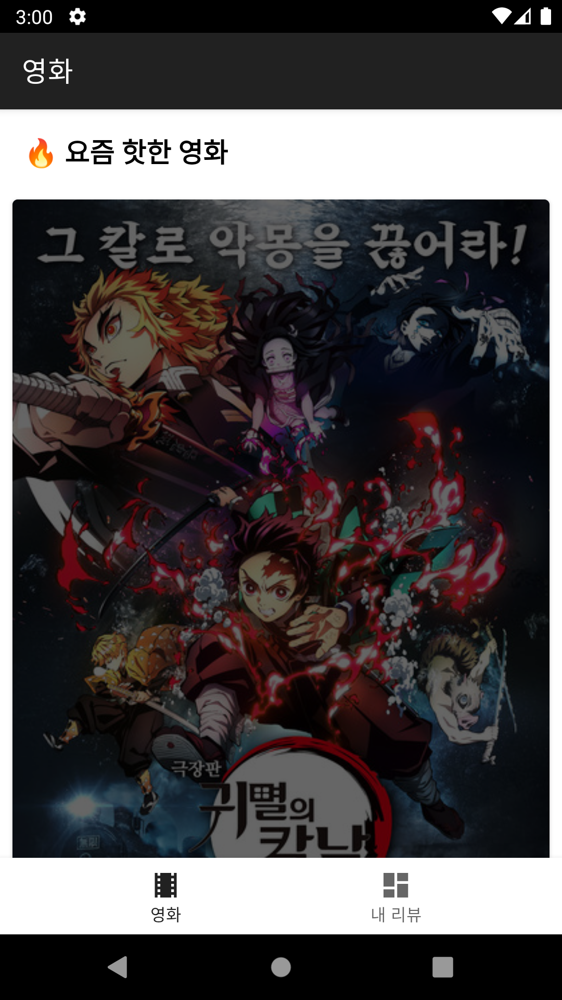
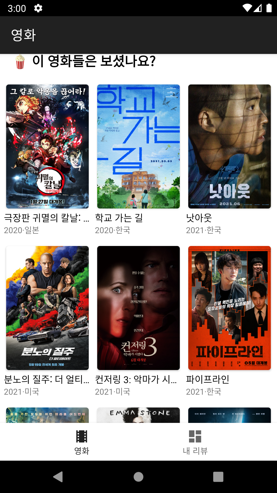
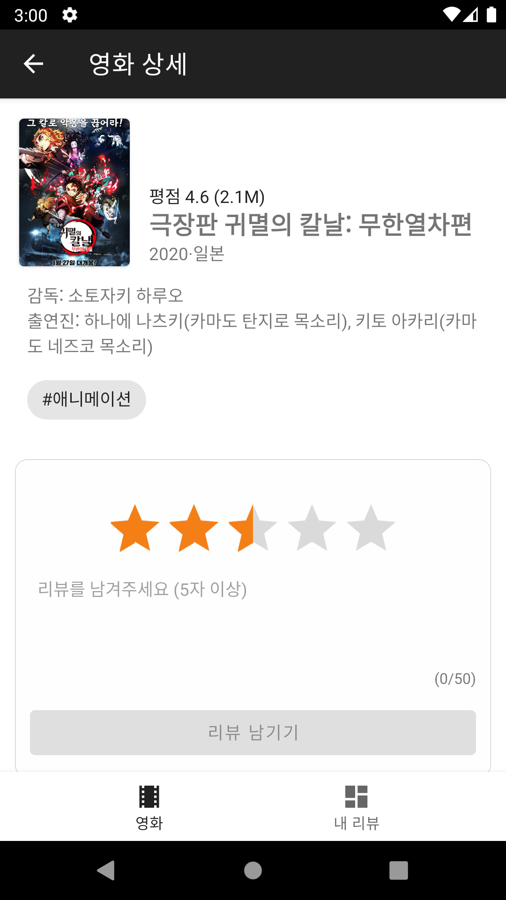
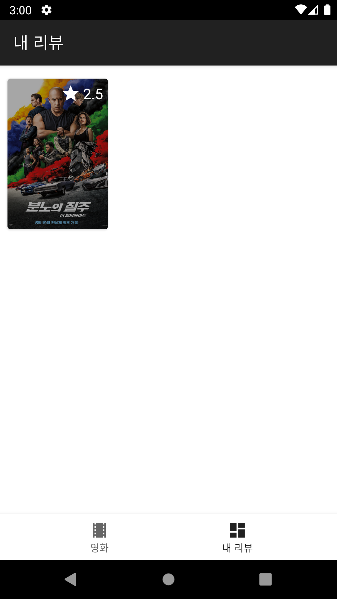

## ⚠️ 주의사항
[Firebase 프로젝트](https://console.firebase.google.com/u/0/) 에서 다운받은 `google-services.json` 파일을 추가해야합니다.

# Android Clone Coding Project #29 Movie
영화 목록 불러오기 & 보여주기
 
영화 리뷰 정보 불러오기 & 보여주기
 
내가 리뷰한 영화 목록 불러오기 & 보여주기
 
리뷰 작성 및 삭제 가능
 

# 결과화면
|Screenshot1|Screenshot2|
|---|---|
|||
|||

 

# 배운 내용 정리
- MVP
- Koin
- Navigation
- Theme
- Usecase
- FireStore
- Repository
